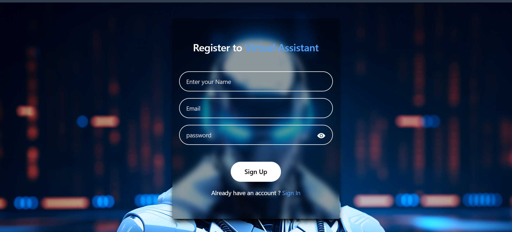
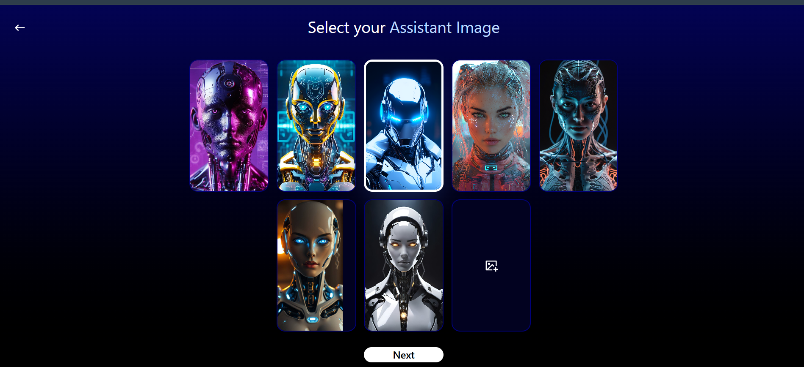

# AI Virtual Assistant Using MERN

An AI-powered virtual assistant web application built with the **MERN Stack** that allows users to interact with an intelligent assistant using text-based commands and receive AI-generated responses.

---

## 🚀 Features

* User Authentication & Authorization
* AI-Powered Chat Assistant Integration
* Gemini API / LLM Support
* Image Selection / Assistant Avatar Support
* Frontend & Backend Separation
* MongoDB Database Integration
* Responsive UI with React + Tailwind CSS
* Secure Environment Variable Management
* REST API Architecture

---

## 🛠 Tech Stack

### Frontend

* React.js
* Vite
* Tailwind CSS
* Axios

### Backend

* Node.js
* Express.js
* MongoDB / Mongoose
* JWT Authentication

### AI Integration

* Google Gemini API

---

## 📂 Project Structure

```bash
AI-Virtual-Assistant-Using-MERN/
│
├── frontend/        # React Frontend
│
├── backend/         # Express Backend
│
└── README.md
```

---

## ⚙️ Installation

### Clone the Repository

```bash
git clone https://github.com/BhashkarKumar2301/AI-virtual-Assistant-using-mern.git
cd AI-Virtual-Assistant-Using-MERN
```

---

### Install Dependencies

#### Frontend

```bash
cd frontend
npm install
```

#### Backend

```bash
cd backend
npm install
```

---

## 🔐 Environment Variables

### Backend `.env`

```env
MONGO_URI=your_mongodb_connection_string
JWT_SECRET=your_jwt_secret
GEMINI_API_KEY=your_gemini_api_key
```

### Frontend `.env`

```env
VITE_SERVER_URL=http://localhost:8000
```

---

## ▶️ Run Locally

### Start Backend

```bash
cd backend
npm run dev
```

### Start Frontend

```bash
cd frontend
npm run dev
```

---

## 🌐 Deployment

* **Frontend:** Render / Vercel
* **Backend:** Render / Railway
* **Database:** MongoDB Atlas

---

## 📸 Screenshots

### Signup Page


### Assistant Interface


## 🤝 Contributing

Contributions are welcome! Feel free to fork the repository and submit a pull request.

---

## 📄 License

This project is licensed under the MIT License.

---

## 👨‍💻 Author

**Bhashkar Kumar**
GitHub: https://github.com/BhashkarKumar2301
